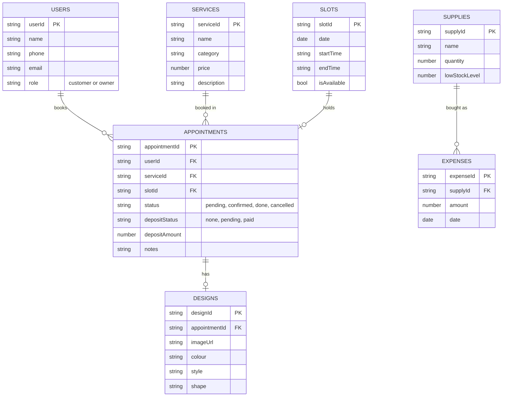

# Database ERD (Firestore)

Draft. Confirm names with Yolanda (Firebase) and Victoria (SRS data dictionary).

```mermaid
erDiagram
    USERS ||--o{ APPOINTMENTS : books
    SERVICES ||--o{ APPOINTMENTS : "booked in"
    SLOTS ||--o| APPOINTMENTS : holds
    APPOINTMENTS ||--o| DESIGNS : has
    SUPPLIES ||--o{ EXPENSES : "bought as"

    USERS {
        string userId PK
        string name
        string phone
        string email
        string role "customer or owner"
    }
    SERVICES {
        string serviceId PK
        string name
        string category
        number price
        string description
    }
    SLOTS {
        string slotId PK
        date date
        string startTime
        string endTime
        bool isAvailable
    }
    APPOINTMENTS {
        string appointmentId PK
        string userId FK
        string serviceId FK
        string slotId FK
        string status "pending, confirmed, done, cancelled"
        string depositStatus "none, pending, paid"
        number depositAmount
        string notes
    }
    DESIGNS {
        string designId PK
        string appointmentId FK
        string imageUrl
        string colour
        string style
        string shape
    }
    SUPPLIES {
        string supplyId PK
        string name
        number quantity
        number lowStockLevel
    }
    EXPENSES {
        string expenseId PK
        string supplyId FK
        number amount
        date date
    }
```

A picture of this diagram is in `ERD.png`.
